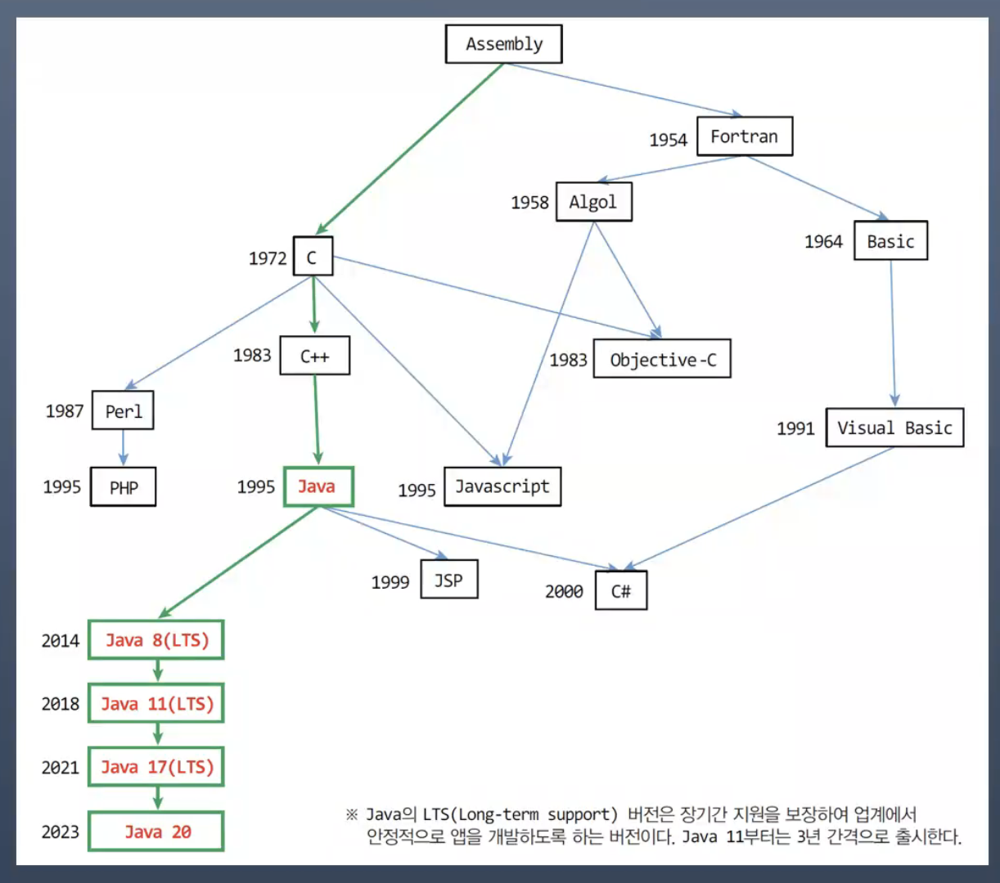

# java2-class2026-dongju
# 202430219 이동주

---

## 3주차 수업 (3월 18일)

## 1. 프로그래밍 언어의 종류

### 1-1. 기계어 (Machine Language)

- `0`과 `1`의 이진수로 구성된 언어
- <span style="color:red">**CPU는 기계어만 이해하고 처리할 수 있음**</span>

---

### 1-2. 어셈블리어 (Assembly Language)

- 기계어 명령을 `ADD`, `SUB`, `MOV` 등의 **니모닉 기호(Mnemonic Symbol)** 로 일대일 대응시킨 언어
- 기계어보다 읽기 쉽지만, 여전히 하드웨어에 종속적

> 💡 니모닉(Mnemonic): 기억하기 쉽도록 만든 상징적 약어

---

### 1-3. 고급 언어 (High-Level Language)

- 사람이 이해하기 쉽도록 설계된 언어
- 예: Pascal, BASIC, C/C++, Java, C#
- **절차 지향 언어**와 **객체 지향 언어**, **함수형 언어**로 분류됨

---

### 1-4. 언어 패러다임 비교

| 구분 | 절차 지향 | 객체 지향 | 함수형 |
|------|-----------|-----------|--------|
| 핵심 개념 | 순서·절차 | 객체·클래스 | 함수·불변성 |
| 데이터 처리 | 데이터와 함수 분리 | 데이터와 함수 캡슐화 | 데이터 변환 |
| 재사용성 | 낮음 | 높음 | 높음 |
| 대표 언어 | C, Pascal, Fortran | Java, C++, Python | Haskell, Lisp, Scala |
| 특징 | 전역 변수 다수 사용 | 상속·캡슐화·다형성 | 순수 함수·고차 함수·재귀 |

#### 절차 지향 언어 (Procedural Language)

- 프로그램을 절차·순서에 따라 실행하는 방식
- 데이터(입력)와 함수를 **분리**하여 작성
- 전역 변수 사용이 많아 코드 가독성·유지보수가 어려움
- 코드 유연성 부족, 재사용 어려움
- 예: `C`, `Pascal`, `Fortran`

#### 객체 지향 언어 (Object-Oriented Language)

- 현실의 객체를 모델링하여 프로그램을 작성하는 방식
- <span style="color:red">**상속(Inheritance), 캡슐화(Encapsulation), 다형성(Polymorphism)**</span> 을 활용
- 유연하고 재사용 가능한 코드 작성 가능
- 예: `Java`, `C++`, `Python`

#### 함수형 언어 (Functional Language)

- <span style="color:red">**함수를 일급 객체(First-Class Object)로 취급**</span>
- 상태 변경을 피하고 **불변성(Immutability)** 을 지향
- 함수의 조합으로 복잡한 작업 수행
- **재귀**, **고차 함수(Higher-Order Function)**, **순수 함수(Pure Function)** 개념 중시
- 병렬 처리와 높은 수준의 추상화 지원
- 예: `Python`, `Kotlin`, `Haskell`, `Lisp`, `Scala`

>  함수형 언어는 객체 지향의 특성을 그대로 가져가되 함수형 기능을 추가한 형태 (Python, Kotlin 등은 멀티 패러다임 언어)

---

## 2. 컴파일 (Compile)

| 용어 | 설명 |
|------|------|
| 소스(Source) | 프로그래밍 언어로 작성된 텍스트 파일 |
| 컴파일(Compile) | 소스 파일을 컴퓨터가 이해할 수 있는 기계어로 변환하는 과정 |

### 언어별 컴파일 과정
```
Java  : .java  →  .class (바이트코드)  →  JVM 실행
C     : .c     →  .obj   →  .exe
C++   : .cpp   →  .obj   →  .exe
```

> 💡 Java는 `.exe`가 아닌 `.class`(바이트코드)로 컴파일되며, JVM 위에서 실행됩니다.

---

## 3. Java의 탄생과 목적

### 3-1. 역사

- **1991년** 썬 마이크로시스템즈(Sun Microsystems)의 **제임스 고슬링(James Gosling)** 이 주도한 **그린 프로젝트(Green Project)** 에서 시작
- 가전 제품용 소프트웨어를 위해 개발 (초기 이름: **오크(Oak)**)
- **1995년** Java 공식 발표
- 인터넷과 웹의 발전과 함께 급격히 성장

### 3-2. 개발 목적: 플랫폼 독립성

**문제점 (기존 언어의 플랫폼 종속성)**

플랫폼 = 하드웨어 + 운영체제

플랫폼 호환성이 없었던 이유:
- CPU마다 기계어가 다름
- 운영체제마다 API가 다름
- 운영체제마다 실행 파일 형식이 다름

**해결 방향**
- 모든 플랫폼에서 호환되는 프로그래밍 언어 필요
- 메모리 사용량이 적고 다양한 플랫폼을 가지는 가전 제품에도 적용 가능하도록 설계

---

## 4. WORA & 바이트코드

### 4-1. WORA (Write Once, Run Anywhere)

> <span style="color:red">**"한번 작성된 코드는 OS·H/W에 상관없이 모든 플랫폼에서 실행된다"**</span>

- C/C++ 등 기존 언어가 가진 **플랫폼 종속성 극복**
- 네트워크에 연결된 어느 클라이언트에서도 실행 가능
- 웹 브라우저, 분산 환경 지원

### 4-2. 바이트코드 (Bytecode)

- 자바 소스를 컴파일한 **목적 코드** (`.class` 파일)
- <span style="color:red">**CPU에 종속적이지 않은 중립적인 코드**</span>
- JVM에 의해 해석되고 실행됨
- CPU가 직접 실행하지 않음 → JVM이 인터프리터 방식으로 해석

### 4-3. JVM (Java Virtual Machine)
```
[ Java Source (.java) ]
        ↓ javac (컴파일러)
[ Byte Code (.class) ]
        ↓ JVM (각 플랫폼별)
[ 실행 결과 ]
```

- <span style="color:red">**JVM 자체는 플랫폼에 종속적**</span> (각 OS에 맞는 JVM이 따로 존재)
- 그러나 JVM이 설치된 곳이라면 **동일한 바이트코드(.class)가 그대로 실행**됨
- 오라클(Oracle) 외 IBM, MS 등 다양한 회사에서 제작·공급
- **실행 환경 = JVM + Java API (클래스 라이브러리)**

---

## 5. JDK 주요 개발 도구

| 도구 | 설명 |
|------|------|
| `javac` | 자바 소스(.java)를 바이트코드(.class)로 변환하는 **컴파일러** |
| `java` | 자바 응용프로그램 실행기 (JVM을 작동시켜 프로그램 실행) |
| `javadoc` | 자바 소스로부터 HTML 형식의 API 도큐먼트 생성 |
| `jar` | 자바 클래스들(패키지 포함)을 압축한 자바 아카이브 파일(.jar) 생성·관리 |
| `jmod` | 자바 모듈 파일(.jmod)을 만들거나 내용 출력 |
| `jlink` | 응용프로그램에 맞춘 맞춤형(Custom) JRE 제공 |
| `jdb` | 자바 응용프로그램 실행 중 오류를 찾는 **디버거** |
| `javap` | 클래스 파일의 바이트코드를 소스와 함께 보여주는 **디어셈블러** |

### javac 기본 사용법
```bash
# 기본
javac 파일명.java

# 다른 폴더에 있는 경우
javac ./src/파일명.java
```

---

## 6. Java 플랫폼 에디션

| 에디션 | 대상 | 주요 내용 |
|--------|------|-----------|
| **Java SE** (Standard Edition) | 데스크톱·서버·임베디드 | `java.lang`, `java.util`, `java.awt` 등 표준 패키지 포함 |
| **Java EE** (Enterprise Edition) | 서버 사이드 개발 | JSP, Servlet, JDBC, EJB 등 웹 프로그래밍 기능 포함 (SE 기반) |
| **Java ME** (Micro Edition) | 임베디드 (휴대폰, PDA, 셋톱박스) | SE 기반으로 소형 기기에 최적화 |

---

## 7. Java 버전 역사

### 버전 표기 변천

- 초기: `1.x` 방식 (예: Java 1.2)
- Java 1.2 이후: `J2SE` (Java 2 Standard Edition)
- Java 1.6 이후: `Java SE 6` 형태로 변경
- 내부 버전 표기는 `1.x.x` 형태로 유지

### LTS (Long-Term Support) 버전

| 버전 | 출시 연도 |
|------|-----------|
| Java 8 (LTS) | 2014 |
| Java 11 (LTS) | 2018 |
| Java 17 (LTS) | 2021 |
| Java 21 (LTS) | 2023 |

> <span style="color:red">**※ LTS 버전은 장기간 지원이 보장되어 업계에서 안정적으로 앱을 개발하도록 하는 버전. Java 11부터는 3년 간격으로 출시.**</span>

---

## 8. Java 9 모듈화 (Modularity)

- **2017년 9월 21일** Java 9에서 도입된 새로운 기능
- **모듈(Module)**: 자바 패키지들과 이미지, XML 파일 등의 자원들을 묶은 단위
- **모듈 프로그래밍**: 레고처럼 필요한 모듈을 연결하는 방식으로 프로그램 작성
- Java 9부터 SE의 모든 클래스들을 모듈로 재구성
- JDK 설치 디렉터리 밑의 `jmods` 디렉터리에서 확인 가능

**모듈화의 장점**
- 실행 시 사용되는 Java API 클래스들을 모듈로 분할
- 필요 없는 모듈 배제 → 작은 크기의 실행 환경 구성
- <span style="color:red">**하드웨어가 열악한 소형 IoT 장치 지원 가능**</span>

---

## 9. Java API와 패키지

### Java API

- JDK에 포함된 **클래스 라이브러리**
- 개발자는 API를 이용하여 쉽고 빠르게 자바 프로그램 개발 가능

### 패키지 (Package)

- 서로 관련된 클래스들을 계층 구조로 묶어 놓은 것 (폴더 개념)
- 클래스 이름에 패키지 이름도 포함
  - 예) `java.lang.System` → `java\lang` 디렉터리의 `System.class`
- 다른 패키지에 동일한 이름의 클래스 존재 가능
- 필요한 클래스가 속한 패키지만 `import`하여 사용
- 사용자 정의 패키지 생성 가능

---

## 10. Java의 주요 특징

### ① 플랫폼 독립성

- 하드웨어·운영체제에 종속되지 않는 바이트코드로 컴파일
- WORA 실현

### ② 객체지향 (OOP)

- <span style="color:red">**캡슐화(Encapsulation), 상속(Inheritance), 다형성(Polymorphism)**</span> 지원
- 자바의 모든 변수와 함수는 **클래스 내에 선언**
- 내부 클래스(Inner Class) 작성 가능

### ③ 소스와 클래스 파일

- 하나의 소스 파일에 여러 클래스 작성 가능 (단, `public` 클래스는 하나만)
- 소스 파일 이름 = `public`으로 선언된 클래스 이름 (반드시 동일해야 함)
- 클래스 파일 하나에는 클래스 하나만 존재
  - 여러 클래스를 가진 소스를 컴파일하면 클래스마다 별도의 `.class` 파일 생성

### ④ 실행 코드 배포

- 한 개 또는 다수의 `.class` 파일로 구성
- 여러 폴더에 걸친 경우 → `jar` 압축 파일로 배포
- 응용프로그램 실행은 <span style="color:red">**`main()` 메소드에서 시작**</span>
- 하나의 클래스 파일에 두 개 이상의 `main()` 메소드 불가

### ⑤ 멀티스레드 (Multi-Thread)

- 여러 스레드의 동시 수행 환경 지원
- <span style="color:red">**운영체제 도움 없이 자체적으로 멀티스레드 지원**</span>
- C/C++은 멀티스레드를 위해 운영체제 API를 호출해야 함

### ⑥ 가비지 컬렉션 (Garbage Collection)

- 자바 언어에는 메모리 할당 기능은 있으나 메모리 반환 기능은 없음
- <span style="color:red">**사용하지 않는 메모리는 JVM이 자동으로 반환 (GC)**</span>
- 개발자가 직접 메모리를 해제하지 않아도 됨 (C/C++과의 차이점)

---

## 11. 프로그래밍 언어 계보

### Java 중심 계보 (강의 자료)



| 언어 | 등장 연도 | 영향 받은 언어 |
|------|-----------|----------------|
| Assembly | - | - |
| Fortran | 1954 | Assembly |
| Algol | 1958 | Fortran |
| C | 1972 | Assembly |
| C++ | 1983 | C |
| **Java** | **1995** | **C++** |
| JavaScript | 1995 | C, Java |
| C# | 2000 | Java, C++ |
| Java 8 (LTS) | 2014 | - |
| Java 11 (LTS) | 2018 | - |
| Java 17 (LTS) | 2021 | - |
| Java 21 (LTS) | 2023 | - |

### 전체 언어 계보 (참고 자료)


> 출처: [Tecky Academy - Evolution of Programming Languages](https://tecky.io/en/blog/evolution-of-programming-languages/)

---

## 2주차 수업 (3월 11일)

## Git 주요 명령어 정리

### 초기 설정

#### git init
- 현재 폴더를 Git 저장소로 초기화함

#### git clone `<주소>`
- 원격 저장소를 복제하여 로컬에 다운로드함

---

### 상태 확인

#### git status
- 현재 파일 상태 확인 (추적 여부, 변경 여부 등)

#### git log
- 커밋 히스토리 확인

---

### 파일 추가 및 커밋

#### git add `<파일명>`
- 특정 파일을 스테이징 영역에 추가

#### git add .
- 현재 폴더의 모든 변경 파일을 추가

#### git commit -m "메시지"
- 스테이징된 파일들을 하나의 버전으로 저장

---

### 원격 저장소 작업

#### git remote add origin `<주소>`
- 원격 저장소 연결

#### git push origin `<브랜치명>`
- 로컬 커밋을 원격 저장소에 업로드

#### git pull origin `<브랜치명>`
- 원격 저장소 변경사항을 내려받고 병합

---

### 브랜치 관리

#### git branch
- 브랜치 목록 확인

#### git branch `<브랜치명>`
- 새로운 브랜치 생성

#### git checkout `<브랜치명>`
- 해당 브랜치로 이동

#### git checkout -b `<브랜치명>`
- 브랜치 생성 + 이동 동시에 수행

---

### 병합

#### git merge `<브랜치명>`
- 현재 브랜치에 다른 브랜치 내용을 합침

---

### 기타 유용한 명령어

#### git diff
- 변경된 내용 상세 비교

#### git reset --hard HEAD
- 마지막 커밋 상태로 완전히 되돌림 (주의)

#### git stash
- 현재 작업 임시 저장

#### git stash pop
- 임시 저장한 작업 다시 가져오기

---

## 마크다운 (Markdown)

> 추후 정리 예정

---

## Java 기본 코드 예제
```java
public class Main {
    public static void main(String[] args) {
        System.out.printf("Hello and welcome!");

        for (int i = 1; i <= 5; i++) {
            System.out.println("i = " + i);
        }
    }
}
```

---

## 1주차 수업

> 내용 없음